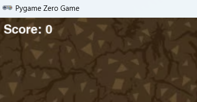

# Snake Game - KodLand



Projeto de um jogo no estilo **Snake**, desenvolvido em **Python** com **Pygame Zero (PgZero)**. O jogador controla a cobra, coleta maçãs para aumentar a pontuação e precisa evitar colisões com as bordas e com o próprio corpo.

## Documentação rápida

- [GDD - Game Design Document](docs/GDD.md)
- [SDD - Software Design Document](docs/SDD.md)

## Visão geral

Este projeto implementa uma versão educacional do clássico jogo da cobrinha, com foco em:

- organização simples de projeto para ensino;
- menu inicial funcional;
- trilha sonora e efeitos sonoros;
- sprites personalizados para cabeça, corpo e cauda;
- pontuação em tempo real;
- pausa durante a partida.

A estrutura foi mantida enxuta para facilitar estudo, manutenção e apresentação do funcionamento do jogo em sala de aula ou em atividades práticas.

## Funcionalidades implementadas

- Menu com botões de **Start**, **Music** e **Exit**.
- Alternância de música de fundo.
- Sistema de movimentação por grade.
- Geração aleatória de maçãs em posições válidas.
- Crescimento da cobra ao coletar maçãs.
- Detecção de colisão com paredes.
- Detecção de colisão com o próprio corpo.
- Retorno ao menu após o fim da partida.
- Exibição da pontuação no HUD.
- Sistema de pausa com tecla de espaço.

## Tecnologias utilizadas

- **Python**
- **Pygame Zero (PgZero)**
- Biblioteca padrão `random`

## Como executar

1. Instale o **Python 3**.
2. Instale o **PgZero**:

```bash
pip install pgzero
```

3. Execute o jogo na pasta do projeto:

```bash
pgzrun main.py
```

## Controles

- **Setas direcionais**: movem a cobra.
- **Barra de espaço**: pausa ou retoma a partida.
- **Mouse**: interage com os botões do menu.

## Regras do jogo

- O objetivo é fazer a maior pontuação possível.
- Cada maçã coletada aumenta a pontuação em **1 ponto**.
- Ao comer uma maçã, a cobra cresce.
- O jogo termina se a cabeça da cobra tocar:
  - as bordas da tela;
  - qualquer parte do próprio corpo.

## Estrutura do projeto

```text
Jogo_Cobrinha_KodLand-main/
├── main.py
├── README.md
├── docs/
│   ├── GDD.md
│   ├── SDD.md
│   └── images/
│       ├── gameplay_screen.png
│       └── menu_screen.png
├── images/
│   ├── apple.png
│   ├── background.png
│   ├── snake.png
│   ├── snake_head_down.png
│   ├── snake_head_left.png
│   ├── snake_head_right.png
│   ├── snake_head_up.png
│   ├── snake_tail_down.png
│   ├── snake_tail_left.png
│   ├── snake_tail_right.png
│   ├── snake_tail_up.png
│   └── thumbnail.png
├── music/
│   └── music.mp3
└── sounds/
    ├── collect.wav
    └── gameover.wav
```

## Organização dos assets

- `images/`: sprites e plano de fundo.
- `sounds/`: efeitos sonoros de coleta e derrota.
- `music/`: trilha principal do jogo.
- `docs/`: documentação funcional e técnica.

## Observações importantes

- O projeto foi estruturado para ser simples e didático, com a lógica concentrada em um único arquivo principal.
- O fluxo atual retorna diretamente ao menu quando ocorre **Game Over**, sem uma tela intermediária de resultado.
- A documentação foi atualizada com base no script existente e nas telas fornecidas do menu e da gameplay.

## Créditos

Desenvolvido por **Arly Alves** em contexto educacional, com proposta de aprendizagem prática sobre lógica de jogos, organização de assets e documentação de projeto.
