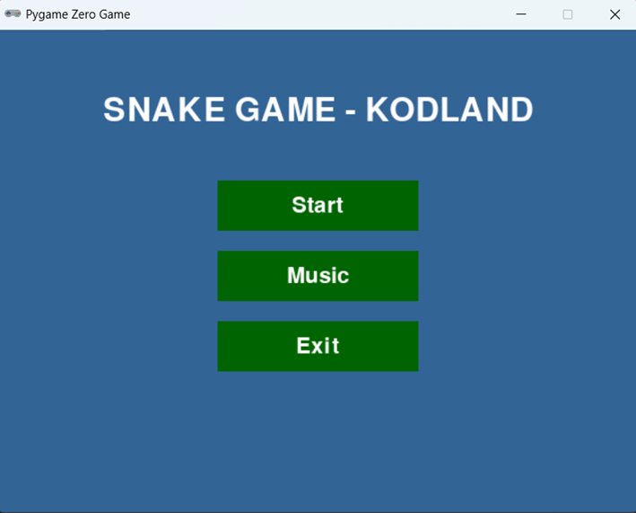

# GDD - Snake Game - KodLand

## 1. Visão geral do jogo

**Snake Game - KodLand** é um jogo 2D inspirado no clássico Snake. O jogador controla uma cobra em uma área fechada, coleta maçãs para aumentar a pontuação e tenta sobreviver o máximo possível sem colidir com as bordas ou com o próprio corpo.

A proposta do projeto é unir simplicidade mecânica com boa organização visual e sonora, servindo tanto como jogo casual quanto como exemplo didático de implementação de estados de jogo, movimentação em grade, colisões e documentação.

## 2. Objetivo do jogo

O objetivo é obter a maior pontuação possível coletando maçãs em sequência e mantendo a cobra viva pelo maior tempo possível.

## 3. Público-alvo

- Estudantes iniciantes em desenvolvimento de jogos.
- Pessoas em processo de aprendizagem de Python e PgZero.
- Jogadores casuais que reconhecem a mecânica clássica de Snake.

## 4. Gênero e plataforma

- **Gênero:** Arcade / Casual
- **Estilo:** 2D em grade
- **Plataforma atual:** Desktop
- **Motor / biblioteca:** Pygame Zero

## 5. Proposta de experiência

A experiência do jogo é direta e rápida:

- entrar no menu;
- iniciar a partida;
- mover a cobra com precisão;
- coletar itens;
- aumentar a pontuação;
- tentar superar a própria marca.

O jogo busca ser simples de entender, rápido de jogar e adequado a demonstrações em aula ou a pequenos desafios de programação.

## 6. Loop principal de gameplay

O ciclo central da experiência é:

1. o jogador inicia a partida no menu;
2. a cobra se move continuamente;
3. o jogador ajusta a direção com as setas;
4. a cobra coleta a maçã;
5. a pontuação aumenta;
6. a cobra cresce;
7. o risco de colisão aumenta;
8. ao ocorrer colisão, a partida termina e retorna ao menu.

## 7. Mecânicas principais

### 7.1 Movimentação

A cobra se desloca em uma grade fixa, em passos de tamanho constante. O movimento é contínuo e controlado pelas setas do teclado.

### 7.2 Coleta

Ao tocar a maçã, a cobra coleta o item, cresce e soma um ponto.

### 7.3 Crescimento

Cada item coletado aumenta o comprimento da cobra, elevando a dificuldade progressivamente.

### 7.4 Colisão

O jogo termina quando a cabeça da cobra colide com:

- as bordas da tela;
- qualquer segmento do próprio corpo.

### 7.5 Pausa

A tecla de espaço alterna entre pausa e retomada da partida, permitindo interromper a ação temporariamente.

### 7.6 Áudio

O jogo possui:

- música de fundo com controle liga/desliga no menu;
- efeito sonoro ao coletar maçã;
- efeito sonoro ao perder.

## 8. Controles

- **Seta para cima:** move para cima
- **Seta para baixo:** move para baixo
- **Seta para esquerda:** move para a esquerda
- **Seta para direita:** move para a direita
- **Espaço:** pausa/continua o jogo
- **Mouse:** interage com o menu

## 9. Interface do usuário

A interface é dividida em dois contextos principais.

### 9.1 Menu inicial

O menu apresenta o título do jogo e três botões centrais:

- **Start**: inicia uma nova partida;
- **Music**: liga ou desliga a trilha sonora;
- **Exit**: encerra a aplicação.

### 9.2 HUD durante a partida

Durante o jogo, a interface exibe:

- plano de fundo customizado;
- cobra com sprites específicos para cabeça, corpo e cauda;
- maçã como item coletável;
- pontuação no canto superior esquerdo;
- texto de pausa quando o jogo está interrompido.

## 10. Direção de arte

O jogo utiliza uma identidade visual simples, legível e funcional:

- fundo texturizado para diferenciar a área jogável;
- sprites próprios para a cobra;
- item visualmente destacado para coleta;
- interface limpa, com poucas informações em tela.

A proposta estética favorece clareza visual e fácil entendimento da ação principal.

## 11. Direção sonora

A camada sonora reforça os estados do jogo:

- música contínua para ambientação;
- som curto para recompensa na coleta;
- som distinto para o encerramento da rodada.

## 12. Condições de vitória e derrota

### Vitória

Não há tela de vitória final. O jogo é orientado à superação de pontuação.

### Derrota

A derrota ocorre em caso de colisão com paredes ou com o próprio corpo.

## 13. Escopo atual

### Implementado

- menu funcional;
- sistema de música;
- movimentação da cobra;
- coleta de maçã;
- crescimento da cobra;
- pontuação;
- colisão com bordas e corpo;
- pausa;
- efeitos sonoros;
- assets organizados em pastas.

### Fora do escopo atual

- ranking de recordes;
- níveis de dificuldade;
- tela dedicada de game over;
- animações avançadas;
- efeitos visuais adicionais;
- suporte mobile.

## 14. Melhorias futuras sugeridas

- adicionar tela de **Game Over** com opção de reinício;
- registrar recorde local;
- incluir níveis de velocidade progressiva;
- adicionar efeitos visuais de transição;
- melhorar feedback visual do botão de música;
- permitir seleção de tema visual.

## 15. Captura de gameplay

## 16. Resumo de design

O projeto cumpre bem uma proposta de jogo compacto e didático. Seu principal valor está na clareza das mecânicas, na simplicidade do fluxo e na facilidade de entendimento para fins de estudo, demonstração e evolução futura.

